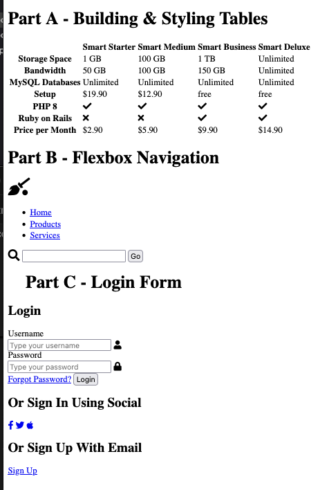
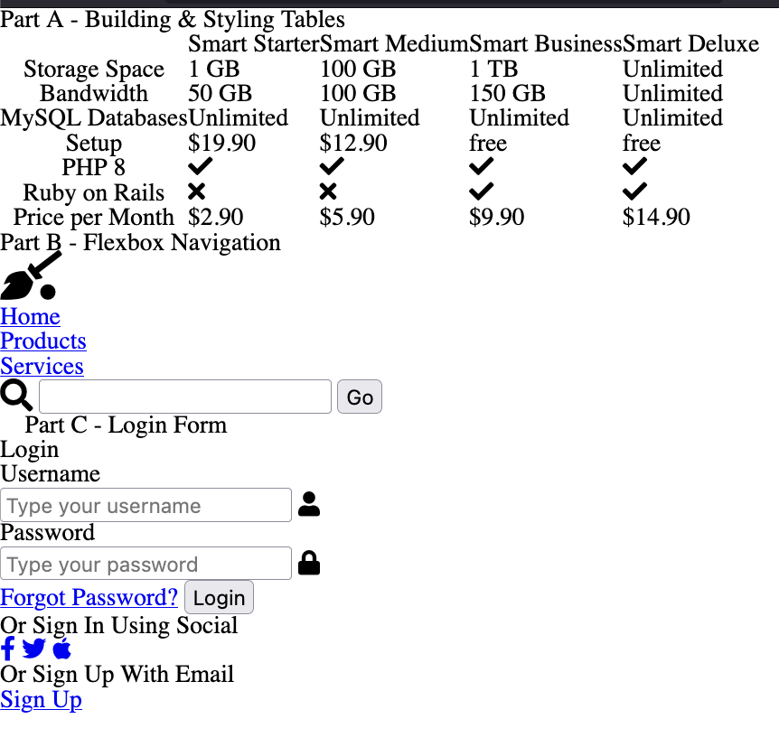
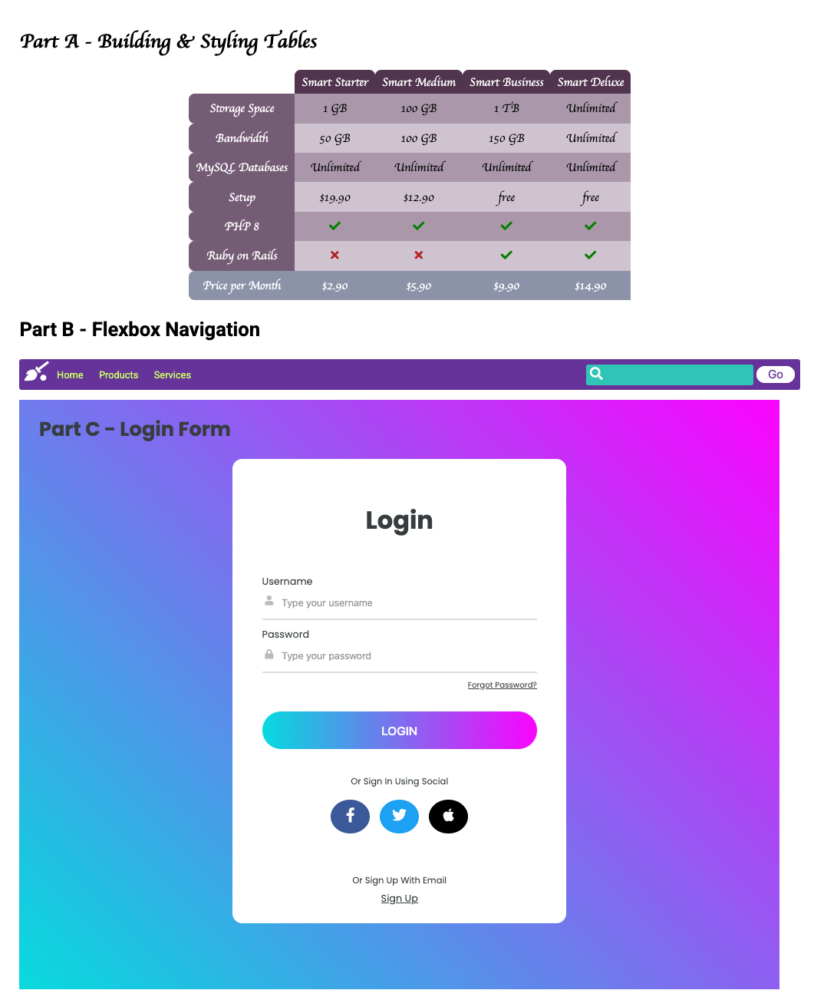
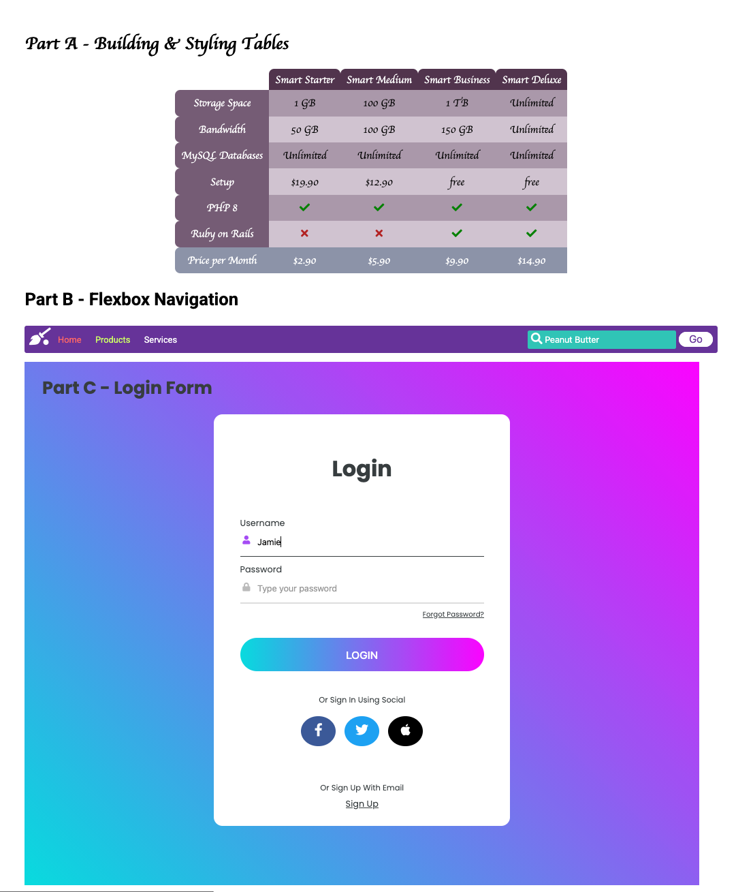

# COIS 2430 Assignment #2

- [COIS 2430 Assignment #2](#cois-2430-assignment-2)
  - [Some General Requirements to Start](#some-general-requirements-to-start)
  - [Question One - More Page Components](#question-one---more-page-components)
    - [Part A - A Web Table](#part-a---a-web-table)
    - [Part B - A Navigation](#part-b---a-navigation)
    - [Part C - A Login Form](#part-c---a-login-form)
    - [HTML View with only Default Browser Styles](#html-view-with-only-default-browser-styles)
    - [HTML View After Reset (no default browser styles)](#html-view-after-reset-no-default-browser-styles)
    - [CSS Styled Page](#css-styled-page)
    - [CSS Styles Illustrating Some State Behaviour](#css-styles-illustrating-some-state-behaviour)
  - [Question Two - Combining Everything You've Learned](#question-two---combining-everything-youve-learned)

## Some General Requirements to Start

For questions one & two, you are not allowed to use the following:

- No pixels!!!
- No nested CSS
- No libraries, themes or frameworks. The only exceptions would be an icon library like font-awesome and/or a syntax highlighting library.
- Your question 2 must be significantly different the styles done in the lab, workshop, and in any other assignment question.
- No JavaScript (except as necessary for the above allowed libraries)
- No inline or embedded CSS (it must all be in your external file)
- Only use CSS covered in Modules One - Six.

For both questions your testing must:

- Be correctly included (and labelled) in the _testing.md_ file.
- Be both **cross-browser** and **cross-platform** (This means along with Chrome and Firefox in your OS of choice, you must test with both Safari on a Mac, and Edge on Windows, so leave enough time to do testing on campus for whichever OS you don't have).
- Must include HTML validation results for each page, showing your HTML is valid.
- Should also illustrate any "state" changes, like hover.
- Include proof of accessibility testing for question two (not just color contrast).

> [!NOTE]
> If you have a hard time getting screenshots with all three parts of Question one, you can screenshot each section seperately.

> [!WARNING]
> Make sure your testing file renders correctly and images load when viewed in your GitHub repository online. If we can't see your testing in the document, you will lose marks!

You are also expected to provide properly formatted well-documented code in all your code files. There are marks for the quality of both the code and documentation.

Along with code quality, documentation and testing, the rubric for this assignment also contains marks for "good git habits". **This means frequent, atomic commits with meaningful commit messages!**

## Question One - More Page Components

For this question, you're going to write the HTML and CSS to generate the a couple of different page components. All three parts MUST be completed on a single HTML page. Please read the following carefully:

- Add a level one heading with the assignment question and your name.
- Place each tasks in its own <section> with a level 2 heading. These sections should have IDs to make it easier write your styles specific to each part.
- You are expected to make the most semantic and accessible choices possible for all HTML elements. Extraneous markup should be kept to a minimum.
- You must start your styling with the CSS reset provided in this file to ensure all styles are your own.

Since you will lose significant marks if you don't use the reset correctly, I would suggest importing the reset at the top of your CSS first, and verify that all styling is gone before continuing on.

Since part of the point is to encourage your use of various selectors, for full marks, other than the above sections, and any form elements that need them for labels, you should only use classes and IDs for necessary semantics and with Font-Awesome icons. Over use of classes and IDs strictly for styling will affect your quality mark.

However, if you're unable to figure out how to select something without giving it a class/ID, give it one. There will be a deduction, but that's certainly better than a 0.

### Part A - A Web Table

Part A includes an HTML table. Information you need includes:

- Color Codes: #755c75, #51344d, #8c93a8, #d0c3d0,aa98aa, green, firebrick, white
- Font: Google Font (Poiret One)
- Icons: Font Awesome (check, xmark)

For a good mark, it's important that you make this table as accessible as possible by implementing the concepts covered in modules six. A proper accessible table structure will also make it easier to apply the styling outlined below.

### Part B - A Navigation

Part B is the navigation component of a page. Information you need includes:

- Color Codes:
  - Visiting links: #ff6666
  - Unvisited links: #ccff66
  - Hovered links: white
  - Search box: #2ec4b6
  - rebeccapurple
  - white
- Font: Google Font (Roboto)
- Icons: Font Awesome (broom-ball,magnifying-glass)

This is a **flexbox** based navigation menu. Other then padding, all spacing/positioning should be controlled using flex properties.

The home link in the nav should point to your assignment file (to trigger visited styling).

The search icon should be placed in the box using absolute positioning.

In the "state" screenshot below, Home is visited, Services is hovered (the mouse doesn't show up in the screenshot) and Products is unvisited.

### Part C - A Login Form

This is the centered modal style login form in the pictures below.

> [!NOTE]
> Yes, the screenshot below contains the twitter icon, rather then the X one. I prefer to forgot that happened. You can use the X icon/colors if you'd prefer!

Information you need to complete part C includes:

- Color Codes
  - Dark Grey general text-color: #373d3f
  - Lighter Grey:#999
  - Lighter Still Grey: #bbb
  - Lightest Grey: #ddd
  - Teal in graient: #00dbde;
  - Pink in Gradient (and hover of hyperlinks): #fc00ff;
- Font: Google Font (Poppins)
- Icons: (facebook-f, twitter/ x-twitter, apple)
- The form must be laid out using either flexbox or grid

### HTML View with only Default Browser Styles

Note: This image is intended solely to provide you some guidance in what the HTML might be. Screenshots of your HTML are not required in your testing, only the finished product.

### HTML View After Reset (no default browser styles)

### CSS Styled Page

### CSS Styles Illustrating Some State Behaviour

> [!NOTE]
> The above state image does not include a hover of the forgot password link in Part C (since I couldn't hover over two things at once). Hovered links for Part C are the pink provided above. The purple icon in the state image, is based on the form control having focus.

## Question Two - Combining Everything You've Learned

Next, you are going to combine everything you've learned about HTML and CSS to make a static site portfolio piece.

The page should first introduce yourself. The content is up to you, but should include a variety of HTML elements, not just text.

This should be followed by an online (HTML-ified) version of your CV (Resume).

The following is a minimum list of requirements you should have across all your content:

- Both pages should start with a CSS reset (imported into your CSS, not included in your HTML)
- Semantic use of HTML5 sectioning elements for page structure
- A variety other semantic HTML elements
- Meaningful use of Grid, Flexbox and the Box Model as appropriate for different layout components
- A table
- Images
- Good use of CSS Custom Properties (variables)
- Non-trivial use of CSS animation
- Use of pseudeo elements
- An accessible colour palette
- Use of media queries
- A manner of traversing between the two pages

The focus of this course is development, not design. However, being able to replicate a provided design for the web is industry relevant experience. It’s not uncommon for a developer to be provided a .psd or figma file designed by someone else, and be asked to reproduce it with HTML and CSS.

For your CV page, you must choose a design from: [https://dribbble.com/search/resume](https://dribbble.com/search/resume) and attempt to replicate it. _A link to the design you chose must be crediting the footer of your page(s)._

> [!NOTE]
> If you sign up for an account, you'll get more choices, but you don't need to.

This question does include a complexity mark based on the design and content you choose.

Since you can't determine the semantic markup for content without meaning, failure to provide meaningful content will result in serious deductions. Pages full of lorem ipsum will receive a failing grade.
